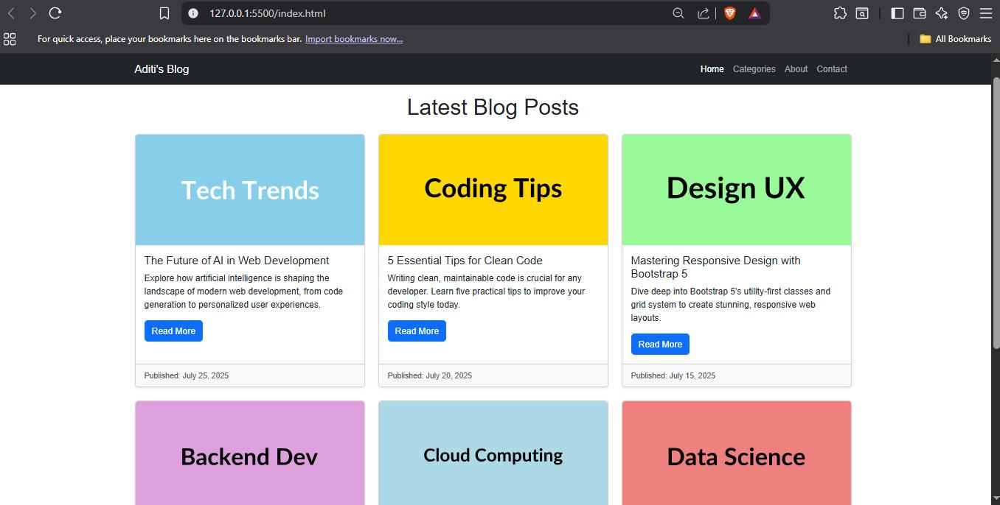
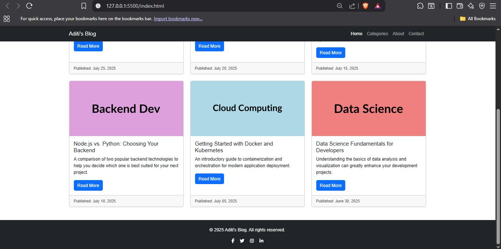

# Simple Blog Layout with Bootstrap 5

This project demonstrates a basic, responsive blog page layout built using **HTML** and styled with **Bootstrap 5**. It features a navigation bar, a grid of blog post cards, and a footer with social icons.

## Features

- **Responsive Navbar** – A collapsible navigation bar that adapts to different screen sizes, including a brand name and navigation links.
- **Blog Post Cards** – A layout of multiple blog post cards, each containing a placeholder image, title, short description, and a "Read More" button.
- **Responsive Grid Layout** – Blog post cards are arranged using Bootstrap's grid system (`row-cols-1`, `row-cols-md-2`, `row-cols-lg-3`) to ensure responsiveness across mobile, tablet, and desktop views.
- **Sticky Navbar** – The navigation bar remains at the top of the viewport when scrolling.
- **Footer with Social Icons** – A simple footer containing copyright information and placeholder social media links (Facebook, Twitter, Instagram, LinkedIn).
- **Basic Styling** – Utilizes Bootstrap's default styling and utility classes for consistent and clean aesthetics.

## Technologies Used

- **HTML5** – Provides the semantic structure of the web page.
- **Bootstrap 5.3.3** – A popular CSS framework for building responsive, mobile-first websites. Used for layout, components (navbar, cards, grid), and utility classes.
- **Bootstrap CSS CDN**
- **Bootstrap JS CDN** (Bundle with Popper)
- **Font Awesome 6.5.2** – Used for scalable vector icons (specifically social media icons in the footer).
- **Google Fonts (Inter)** – Imported for a modern and clean font style.
- **Placeholder Images** – [placehold.co](https://placehold.co) is used for dynamic placeholder images for blog post cards.

## Installation and Setup

1. **Save the HTML File**  
   Copy the entire HTML code into a file named `index.html` on your computer.

2. **Open in Browser**  
   Navigate to the `index.html` file in your file explorer and open it with your preferred web browser (e.g., Chrome, Firefox, Edge).

## Usage

- The page will display a responsive blog layout.
- The navbar will collapse on smaller screens, and the blog post cards will rearrange themselves into 1, 2, or 3 columns based on the screen width.
- Clicking "Read More" buttons or social icons will not lead anywhere as they are placeholder links (`#`).

## Preview
_
_

## Author
- ADITI BHATT - Frontend Developer
  
